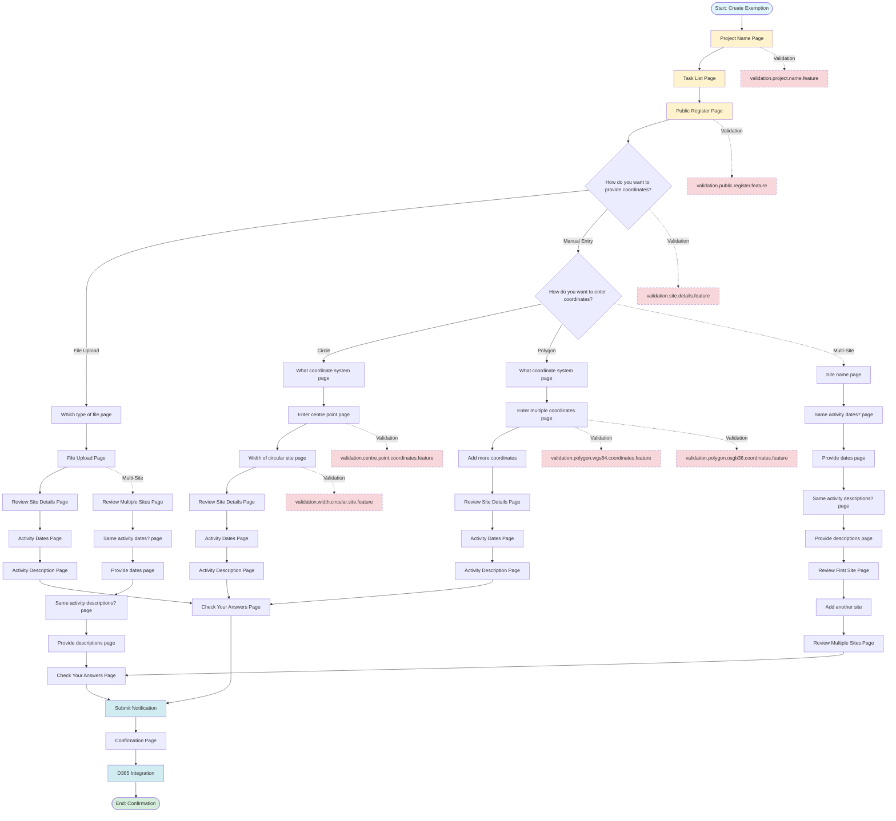

# Marine Licensing Journey Tests - Repository Assessment Analysis

## Executive Summary

This analysis provides a comprehensive assessment of the Marine Licensing Journey Tests repository, focusing on:

1. **Business Logic Grouping** - How features are organized by the business logic they test
2. **Scenario Overlap Analysis** - Identification of scenarios that cover subsets of User Journeys covered by other scenarios

The repository contains **33 feature files** covering the complete exemption notification workflow for the Marine Management Organisation (MMO), from project creation through to submission and D365 integration.

---

## 1. Business Logic Grouping

### User Journeys Overview

Based on analysis of user stories in `documentation/user-stories/`, the following User Journeys have been identified:

#### **User Journey 1: Complete Exemption Notification Submission (Single Site)**

**Business Purpose**: Enable applicants to submit a complete exemption notification with a single site location.

**Complete Flow**:

1. **Project Setup** (ML-1): Create exemption and provide project name
2. **Task List Navigation** (ML-9): View and navigate task list
3. **Public Register Consent** (ML-12): Consent or withhold from public register
4. **Site Details Entry** - Choose one of three pathways:
   - **Pathway A - File Upload**: ML-69 (choose file type) → ML-70 (upload file) → ML-74 (review site details) → ML-389 (activity dates) → ML-390 (activity description)
   - **Pathway B - Manual Circle**: ML-16 (choose manual entry) → ML-17 (choose circle) → ML-18 (choose coordinate system) → ML-35 (enter centre point) → ML-36 (enter width) → ML-37 (review) → ML-416 (activity dates) → ML-417 (activity description)
   - **Pathway C - Manual Polygon**: ML-16 (choose manual entry) → ML-17 (choose polygon) → ML-18 (choose coordinate system) → ML-19 (enter coordinates) → ML-38 (add more coordinates) → ML-121 (review) → ML-416 (activity dates) → ML-417 (activity description)
5. **Check Your Answers** (ML-82, ML-139, ML-140): Review all provided information
6. **Submit Notification** (ML-84): Submit notification and receive confirmation
7. **D365 Integration** (ML-379): Case created in Dynamics 365

**Scope**: Complete end-to-end workflow for single-site exemption notifications.

#### **User Journey 2: Multi-Site Exemption Notification Submission**

**Business Purpose**: Enable applicants to submit exemption notifications with multiple sites, supporting efficient workflows for activities spanning multiple locations.

**Complete Flow**:

1. **Project Setup** (ML-1): Create exemption and provide project name
2. **Task List Navigation** (ML-9): View and navigate task list
3. **Public Register Consent** (ML-12): Consent or withhold from public register
4. **Multi-Site Entry** - Choose one of three pathways:
   - **Pathway A - File Upload Multi-Site**: ML-69 → ML-70 (upload file with multiple sites) → ML-232 (review multiple sites) → ML-119 (are all dates same?) → ML-75 (provide dates) → ML-120 (are all descriptions same?) → ML-76 (provide descriptions) → ML-364 (add missing site info)
   - **Pathway B - Manual Multi-Site**: ML-16 → ML-228 (provide site name) → ML-419 (are all dates same?) → ML-420 (provide dates) → ML-114 (are all descriptions same?) → ML-421 (provide descriptions) → ML-361 (review first site) → ML-362 (add another site) → ML-608 (review multiple sites)
5. **Check Your Answers** (ML-140, ML-810): Review all sites and information
6. **Submit Notification** (ML-84): Submit notification
7. **D365 Integration** (ML-379): Case created in Dynamics 365

**Scope**: Complete workflow supporting multiple sites per notification with intelligent conditional routing.

#### **User Journey 3: Site Details Modification and Review**

**Business Purpose**: Enable applicants to modify site details and activity information after initial entry.

**Complete Flow**:

1. **Review Site Details** (ML-37, ML-74, ML-121, ML-232, ML-361, ML-608): View entered site details
2. **Change Activity Details** (ML-695, ML-696): Modify activity dates/descriptions from review page
3. **Change Site Details** (ML-697, ML-723): Modify site coordinates, coordinate system, or site type
4. **Delete Sites** (ML-233, ML-694): Remove individual sites or all sites
5. **Add Another Site** (ML-362): Add additional sites from review page

**Scope**: Post-entry modification workflows for site and activity information.

#### **User Journey 4: Check Your Answers Modification**

**Business Purpose**: Enable applicants to modify any information from the final review page before submission.

**Complete Flow**:

1. **Check Your Answers** (ML-82, ML-139, ML-140): View all answers
2. **Change Project Name** (ML-83): Modify project name
3. **Change Site Details** (ML-83): Navigate to review site details to modify
4. **Change Activity Details** (ML-83): Modify activity dates/descriptions
5. **Change Public Register Consent** (ML-83): Modify consent decision
6. **Return to Check Your Answers**: View updated information

**Scope**: Pre-submission modification workflows.

#### **User Journey 5: Dashboard and Case Management**

**Business Purpose**: Enable applicants to view, manage, and continue draft notifications.

**Complete Flow**:

1. **View Dashboard** (ML-96): View list of all notifications
2. **Continue Draft** (ML-99): Resume work on draft notification
3. **Delete Draft** (ML-100): Remove draft notification
4. **View Submitted Notification** (ML-96): View details of submitted notification
5. **D365 Case Verification** (ML-379): Verify case creation in D365

**Scope**: Notification lifecycle management and tracking.

#### **User Journey 6: Authentication and Navigation**

**Business Purpose**: Support user authentication and system navigation.

**Complete Flow**:

1. **DEFRA ID Authentication** (ML-277): Authenticate via DEFRA ID
2. **Page Header/Footer** (ML-20, ML-279): Navigate via header/footer links
3. **Privacy Policy** (ML-644): Access privacy policy
4. **Cookies** (ML-278, ML-518): Manage cookie preferences
5. **Redirect When Logged Out** (ML-620): Redirect to login when session expires

**Scope**: Authentication, navigation, and compliance features.

#### **User Journey 7: IAT (Intelligent Assessment and Testing) Integration**

**Business Purpose**: Support integration with Fivium IAT system for activity context.

**Complete Flow**:

1. **Launch from IAT** (ML-111): Receive notification context from Fivium
2. **IAT Context Preservation** (ML-142): Maintain IAT context throughout journey
3. **MCMS Context Validation** (ML-918): Validate context data

**Scope**: External system integration for activity context.

---

### Feature Groups by Business Logic

Features are grouped below by the business logic they test:

#### **Group 1: Core Notification Submission Workflow**

**Business Domain**: Complete exemption notification submission

**Features**:

- `submit.notification.feature` - Complete submission workflow (ML-1, ML-9, ML-10, ML-11, ML-12, ML-16, ML-17, ML-18, ML-21, ML-35, ML-36, ML-37, ML-82, ML-84, ML-715)
- `check.your.answers.feature` - Final review before submission (ML-82, ML-139, ML-140, ML-142, ML-810)
- `task.list.feature` - Task list navigation (ML-9)
- `public.register.feature` - Public register consent (ML-12, ML-145)

**Business Logic**: These features test the complete end-to-end workflow of creating and submitting an exemption notification, covering all required steps from project creation through submission.

#### **Group 2: Site Details Entry - File Upload**

**Business Domain**: Site location entry via file upload (KML/Shapefile)

**Features**:

- `upload.coordinate.file.feature` - File upload workflow (ML-69, ML-70, ML-74)
- `kml.file.site.details.multi.site.feature` - Multi-site KML upload (ML-75, ML-76, ML-119, ML-120, ML-232, ML-364, ML-388)
- `shapefile.site.details.multi.site.feature` - Multi-site Shapefile upload (ML-75, ML-76, ML-119, ML-120, ML-232, ML-364, ML-388)
- `validate.shapefile.missing.files.feature` - Shapefile validation (ML-764)

**Business Logic**: These features test file-based site entry workflows, including single and multi-site file uploads, file validation, and activity information capture for uploaded sites.

#### **Group 3: Site Details Entry - Manual Entry**

**Business Domain**: Site location entry via manual coordinate input

**Features**:

- `site.details.manual.polygon.feature` - Manual polygon entry (ML-16, ML-17, ML-18, ML-19, ML-38, ML-121, ML-361, ML-608)
- `manual.site.details.multi.site.feature` - Manual multi-site entry (ML-114, ML-228, ML-419, ML-420, ML-421, ML-361, ML-608)

**Business Logic**: These features test manual coordinate entry workflows for both single and multiple sites, including circular and polygon site types with WGS84 and OSGB36 coordinate systems.

#### **Group 4: Site Details Validation**

**Business Domain**: Input validation for site details

**Features**:

- `validation.site.details.feature` - Site details method selection validation (ML-16, ML-17, ML-18)
- `validation.centre.point.coordinates.feature` - Circular site coordinate validation (ML-35)
- `validation.width.circular.site.feature` - Circular site width validation (ML-36)
- `validation.polygon.wgs84.coordinates.feature` - Polygon WGS84 coordinate validation (ML-19, ML-38)
- `validation.polygon.osgb36.coordinates.feature` - Polygon OSGB36 coordinate validation (ML-19, ML-38)
- `validation.coordinates.leading.zeroes.feature` - Leading zero coordinate support (ML-891)

**Business Logic**: These features test validation rules for site details entry, ensuring data quality and preventing invalid submissions.

#### **Group 5: Site Details Modification**

**Business Domain**: Post-entry modification of site and activity details

**Features**:

- `change.activity.details.review.site.details.feature` - Modify activity details from review (ML-695, ML-696, ML-910)
- `change.site.details.boundary.review.site.details.feature` - Modify boundary site details (ML-697)
- `change.site.details.circular.review.site.details.feature` - Modify circular site details (ML-723)
- `delete.all.site.details.review.site.details.feature` - Delete all sites (ML-694)
- `change.answers.check.your.answers.feature` - Modify answers from CYA page (ML-83)

**Business Logic**: These features test modification workflows allowing users to correct or update information after initial entry.

#### **Group 6: Dashboard and Case Management**

**Business Domain**: Notification lifecycle management

**Features**:

- `dashboard.feature` - Dashboard functionality (ML-96, ML-99, ML-100, ML-124, ML-591)
- `submit.notification.to.d365.feature` - D365 case creation verification (ML-379)
- `d365.login.feature` - D365 authentication

**Business Logic**: These features test notification management, including viewing, continuing drafts, deleting drafts, and verifying D365 integration.

#### **Group 7: Authentication and Navigation**

**Business Domain**: User authentication and system navigation

**Features**:

- `real.defra.id.integration.feature` - DEFRA ID authentication (ML-277)
- `redirect.to.login.when.logged.out.feature` - Session expiry handling (ML-620)
- `header.and.footer.feature` - Header/footer navigation (ML-20, ML-279, ML-644)
- `cookies.feature` - Cookie management (ML-278, ML-518)
- `privacy.policy.feature` - Privacy policy access (ML-644)

**Business Logic**: These features test authentication flows, session management, and navigation elements.

#### **Group 8: Project Setup Validation**

**Business Domain**: Project name validation

**Features**:

- `validation.project.name.feature` - Project name validation (ML-1)

**Business Logic**: These features test validation rules for project name entry.

#### **Group 9: Public Register Validation**

**Business Domain**: Public register consent validation

**Features**:

- `validation.public.register.feature` - Public register validation

**Business Logic**: These features test validation rules for public register consent.

#### **Group 10: IAT Integration**

**Business Domain**: External system integration

**Features**:

- `launch.fivium.iat.feature` - IAT context integration (ML-111)
- `mcms.context.validation.feature` - MCMS context validation (ML-918)

**Business Logic**: These features test integration with external systems for activity context.

---

### Scenario-to-User-Journey Mapping

#### **User Journey 1: Complete Exemption Notification Submission (Single Site)**

| Feature File                          | Scenario                                                                                                                                                        | User Journey Coverage | Portion Covered                                 |
| ------------------------------------- | --------------------------------------------------------------------------------------------------------------------------------------------------------------- | --------------------- | ----------------------------------------------- |
| `submit.notification.feature`         | After successfully completing all the tasks on the task list, the user is able to submit their notification                                                     | Complete Journey      | 100% (all steps)                                |
| `submit.notification.feature`         | Site details completion fails after switching from file upload to manual entry                                                                                  | Partial Journey       | Steps 1-4 (project setup through site details)  |
| `check.your.answers.feature`          | After successfully completing all the tasks on the task list, with a circle using WGS84 coordinates, the user is able to access the "Check your answers" page   | Partial Journey       | Steps 1-5 (project setup through check answers) |
| `check.your.answers.feature`          | After successfully completing all the tasks on the task list, with a boundary using WGS84 coordinates, the user is able to access the "Check your answers" page | Partial Journey       | Steps 1-5 (project setup through check answers) |
| `check.your.answers.feature`          | After successfully completing all the tasks on the task list, with KML file upload, the user is able to access the "Check your answers" page                    | Partial Journey       | Steps 1-5 (project setup through check answers) |
| `check.your.answers.feature`          | After successfully completing all the tasks on the task list, with Shapefile upload, the user is able to access the "Check your answers" page                   | Partial Journey       | Steps 1-5 (project setup through check answers) |
| `upload.coordinate.file.feature`      | Successfully upload a valid KML file and review site details                                                                                                    | Partial Journey       | Steps 4A (file upload pathway)                  |
| `upload.coordinate.file.feature`      | Successfully upload a valid Shapefile and review site details                                                                                                   | Partial Journey       | Steps 4A (file upload pathway)                  |
| `site.details.manual.polygon.feature` | Successfully entering triangular site coordinates using WGS84 coordinates                                                                                       | Partial Journey       | Steps 4C (manual polygon pathway)               |
| `task.list.feature`                   | Display the task list page                                                                                                                                      | Partial Journey       | Steps 1-2 (project setup and task list)         |
| `public.register.feature`             | Allowing information to be added to the public register                                                                                                         | Partial Journey       | Step 3 (public register consent)                |

#### **User Journey 2: Multi-Site Exemption Notification Submission**

| Feature File                                | Scenario                                                                                                                    | User Journey Coverage | Portion Covered                                 |
| ------------------------------------------- | --------------------------------------------------------------------------------------------------------------------------- | --------------------- | ----------------------------------------------- |
| `kml.file.site.details.multi.site.feature`  | Complete a multi-site kml file upload with different activity dates and different descriptions                              | Partial Journey       | Steps 4A (multi-site file upload pathway)       |
| `kml.file.site.details.multi.site.feature`  | Complete a multi-site kml file upload with same activity dates and descriptions                                             | Partial Journey       | Steps 4A (multi-site file upload pathway)       |
| `shapefile.site.details.multi.site.feature` | Complete a multi-site shapefile upload with different activity dates and different descriptions                             | Partial Journey       | Steps 4A (multi-site file upload pathway)       |
| `shapefile.site.details.multi.site.feature` | Complete a multi-site shapefile upload with same activity dates and descriptions                                            | Partial Journey       | Steps 4A (multi-site file upload pathway)       |
| `manual.site.details.multi.site.feature`    | Complete mixed site details with separate activity dates and descriptions                                                   | Partial Journey       | Steps 4B (manual multi-site pathway)            |
| `manual.site.details.multi.site.feature`    | Complete mixed site details with same activity dates and descriptions                                                       | Partial Journey       | Steps 4B (manual multi-site pathway)            |
| `check.your.answers.feature`                | After successfully uploading a KML file with multiple sites, the user is able to access the "Check your answers" page       | Partial Journey       | Steps 1-5 (project setup through check answers) |
| `check.your.answers.feature`                | After successfully uploading a Shapefile file with multiple sites, the user is able to access the "Check your answers" page | Partial Journey       | Steps 1-5 (project setup through check answers) |
| `check.your.answers.feature`                | After successfully manually entering multiple sites, the user is able to access the "Check your answers" page               | Partial Journey       | Steps 1-5 (project setup through check answers) |

#### **User Journey 3: Site Details Modification and Review**

| Feature File                                               | Scenario                                                      | User Journey Coverage | Portion Covered                  |
| ---------------------------------------------------------- | ------------------------------------------------------------- | --------------------- | -------------------------------- |
| `change.activity.details.review.site.details.feature`      | The user can change their project level activity dates        | Partial Journey       | Step 2 (change activity details) |
| `change.activity.details.review.site.details.feature`      | The user can change their site level activity dates           | Partial Journey       | Step 2 (change activity details) |
| `change.site.details.boundary.review.site.details.feature` | The user can change from boundary site to circular site       | Partial Journey       | Step 3 (change site details)     |
| `change.site.details.boundary.review.site.details.feature` | The user can change the coordinate system for a boundary site | Partial Journey       | Step 3 (change site details)     |
| `delete.all.site.details.review.site.details.feature`      | The user can delete all site details after confirmation       | Partial Journey       | Step 4 (delete sites)            |

#### **User Journey 4: Check Your Answers Modification**

| Feature File                                | Scenario                                                                         | User Journey Coverage | Portion Covered                  |
| ------------------------------------------- | -------------------------------------------------------------------------------- | --------------------- | -------------------------------- |
| `change.answers.check.your.answers.feature` | The user can change their project name from check your answers                   | Partial Journey       | Step 2 (change project name)     |
| `change.answers.check.your.answers.feature` | The user can change activity details from check your answers with multiple sites | Partial Journey       | Step 4 (change activity details) |
| `change.answers.check.your.answers.feature` | The user can change a specific site from check your answers                      | Partial Journey       | Step 3 (change site details)     |

#### **User Journey 5: Dashboard and Case Management**

| Feature File                          | Scenario                                                   | User Journey Coverage | Portion Covered                             |
| ------------------------------------- | ---------------------------------------------------------- | --------------------- | ------------------------------------------- |
| `dashboard.feature`                   | After submitting a notification, view it via the dashboard | Partial Journey       | Steps 1, 4 (view dashboard, view submitted) |
| `dashboard.feature`                   | Continue a draft notification from the dashboard           | Partial Journey       | Step 2 (continue draft)                     |
| `dashboard.feature`                   | Delete a draft notification from the dashboard             | Partial Journey       | Step 3 (delete draft)                       |
| `submit.notification.to.d365.feature` | [D365 verification scenarios]                              | Partial Journey       | Step 5 (D365 verification)                  |

#### **User Journey 6: Authentication and Navigation**

| Feature File                                | Scenario                  | User Journey Coverage | Portion Covered                   |
| ------------------------------------------- | ------------------------- | --------------------- | --------------------------------- |
| `real.defra.id.integration.feature`         | [DEFRA ID scenarios]      | Partial Journey       | Step 1 (authentication)           |
| `redirect.to.login.when.logged.out.feature` | [Redirect scenarios]      | Partial Journey       | Step 5 (redirect when logged out) |
| `header.and.footer.feature`                 | [Header/footer scenarios] | Partial Journey       | Step 2 (navigation)               |
| `cookies.feature`                           | [Cookie scenarios]        | Partial Journey       | Step 5 (cookies)                  |

#### **User Journey 7: IAT Integration**

| Feature File                      | Scenario                    | User Journey Coverage | Portion Covered             |
| --------------------------------- | --------------------------- | --------------------- | --------------------------- |
| `launch.fivium.iat.feature`       | [IAT launch scenarios]      | Partial Journey       | Step 1 (IAT launch)         |
| `mcms.context.validation.feature` | [MCMS validation scenarios] | Partial Journey       | Step 3 (context validation) |

---

## 2. Scenario Overlap Analysis

### Subset Relationships

The following scenarios have been identified where one scenario covers a subset of another scenario's User Journey:

#### **Overlap Pattern 1: Complete Journey vs. Partial Journey Scenarios**

**Complete Journey Scenario**:

- **Feature**: `submit.notification.feature`
- **Scenario**: "After successfully completing all the tasks on the task list, the user is able to submit their notification"
- **User Journey Coverage**: 100% of User Journey 1 (Complete Exemption Notification Submission)

**Subset Scenarios** (covering portions of the same journey):

- **Feature**: `check.your.answers.feature`
  - **Scenarios**: All "After successfully completing all the tasks..." scenarios
  - **User Journey Coverage**: ~80% of User Journey 1 (Steps 1-5, missing submission step)
  - **Relationship**: These scenarios are subsets of the complete submission journey

- **Feature**: `upload.coordinate.file.feature`
  - **Scenarios**: "Successfully upload a valid KML file and review site details"
  - **User Journey Coverage**: ~20% of User Journey 1 (only file upload portion)
  - **Relationship**: This scenario is a subset of the complete journey

- **Feature**: `site.details.manual.polygon.feature`
  - **Scenarios**: "Successfully entering triangular site coordinates..."
  - **User Journey Coverage**: ~15% of User Journey 1 (only manual polygon entry portion)
  - **Relationship**: This scenario is a subset of the complete journey

**Extent of Overlap**: The complete journey scenario in `submit.notification.feature` fully encompasses all partial journey scenarios. The partial scenarios test individual components that are combined in the complete journey.

#### **Overlap Pattern 2: Multi-Site File Upload Variations**

**Broader Scenario**:

- **Feature**: `kml.file.site.details.multi.site.feature`
- **Scenario**: "Complete a multi-site kml file upload with different activity dates and different descriptions"
- **User Journey Coverage**: Complete multi-site file upload workflow with all decision points

**Subset Scenarios**:

- **Feature**: `kml.file.site.details.multi.site.feature`
  - **Scenario**: "Complete a multi-site kml file upload with same activity dates and descriptions"
  - **User Journey Coverage**: Same workflow but with different data (same dates/descriptions)
  - **Relationship**: Tests the same User Journey with different input data - not a true subset but tests a variation

**Extent of Overlap**: These scenarios test the same User Journey (multi-site file upload) with different data combinations. They are variations rather than true subsets, but they cover the same business logic with different decision paths.

#### **Overlap Pattern 3: Validation Scenarios vs. Complete Workflows**

**Complete Workflow Scenarios**:

- **Feature**: `submit.notification.feature`
- **Scenario**: Complete submission journey
- **User Journey Coverage**: 100% including validation steps

**Validation-Only Scenarios**:

- **Feature**: `validation.site.details.feature`
  - **Scenarios**: Validation error scenarios
  - **User Journey Coverage**: ~5% (only validation step of site details entry)
  - **Relationship**: These scenarios test only the validation portion of a larger journey

- **Feature**: `validation.project.name.feature`
  - **Scenarios**: Project name validation errors
  - **User Journey Coverage**: ~3% (only validation step of project setup)
  - **Relationship**: These scenarios test only the validation portion of a larger journey

**Extent of Overlap**: Validation scenarios are subsets that focus on error conditions within larger workflows. They test specific validation rules that are also exercised (implicitly) in complete journey scenarios.

#### **Overlap Pattern 4: Single-Site vs. Multi-Site Scenarios**

**Single-Site Scenarios**:

- **Feature**: `upload.coordinate.file.feature`
- **Scenario**: "Successfully upload a valid KML file and review site details"
- **User Journey Coverage**: Single-site file upload workflow

**Multi-Site Scenarios**:

- **Feature**: `kml.file.site.details.multi.site.feature`
- **Scenario**: "Complete a multi-site kml file upload with different activity dates and different descriptions"
- **User Journey Coverage**: Multi-site file upload workflow

**Relationship**: Multi-site scenarios extend single-site scenarios with additional decision points (same dates/descriptions questions) and multi-site review. The single-site scenario is a subset of the multi-site scenario's workflow.

**Extent of Overlap**: Single-site scenarios cover approximately 60% of the multi-site workflow (missing the "same dates/descriptions" decision points and multi-site review).

#### **Overlap Pattern 5: Check Your Answers Variations**

**Complete Check Your Answers Scenarios**:

- **Feature**: `check.your.answers.feature`
- **Scenarios**: Multiple scenarios testing CYA page access with different site types
- **User Journey Coverage**: Steps 1-5 of User Journey 1

**Subset Scenarios**:

- **Feature**: `change.answers.check.your.answers.feature`
  - **Scenarios**: Change links from CYA page
  - **User Journey Coverage**: Steps 1-5 + modification workflows
  - **Relationship**: These scenarios extend the CYA scenarios with modification capabilities

**Extent of Overlap**: Change scenarios build upon CYA scenarios, adding modification workflows. They cover 100% of the CYA journey plus additional modification steps.

### Overlap Patterns

#### **Pattern 1: Complete Journey vs. Component Testing**

**Description**: Complete end-to-end scenarios vs. scenarios testing individual components.

**Examples**:

- `submit.notification.feature` (complete) vs. `upload.coordinate.file.feature` (component)
- `submit.notification.feature` (complete) vs. `site.details.manual.polygon.feature` (component)
- `submit.notification.feature` (complete) vs. `check.your.answers.feature` (component)

**Rationale**: Component testing provides focused validation of specific functionality, while complete journey testing validates integration and end-to-end workflows.

#### **Pattern 2: Data Variation Testing**

**Description**: Same User Journey tested with different data combinations.

**Examples**:

- `kml.file.site.details.multi.site.feature`: Different combinations of same/different dates and descriptions
- `shapefile.site.details.multi.site.feature`: Different combinations of same/different dates and descriptions
- `manual.site.details.multi.site.feature`: Different combinations of same/different dates and descriptions
- `check.your.answers.feature`: Different coordinate systems (WGS84/OSGB36) and site types (circle/boundary)

**Rationale**: Ensures business logic works correctly across all valid data combinations.

#### **Pattern 3: Entry Method Variations**

**Description**: Same User Journey tested with different site entry methods.

**Examples**:

- File upload (KML) vs. File upload (Shapefile) vs. Manual entry (Circle) vs. Manual entry (Polygon)
- All tested in `check.your.answers.feature` and `submit.notification.feature`

**Rationale**: Validates that all entry pathways lead to successful submission.

#### **Pattern 4: Validation-Focused Scenarios**

**Description**: Scenarios focused solely on validation rules vs. scenarios that include validation as part of a larger flow.

**Examples**:

- `validation.site.details.feature` (validation only) vs. `site.details.manual.polygon.feature` (includes validation)
- `validation.project.name.feature` (validation only) vs. `submit.notification.feature` (includes validation)

**Rationale**: Validation scenarios provide comprehensive error condition testing, while workflow scenarios validate happy paths.

#### **Pattern 5: Single-Site vs. Multi-Site Extensions**

**Description**: Single-site scenarios vs. multi-site scenarios that extend the same workflow.

**Examples**:

- `upload.coordinate.file.feature` (single-site) vs. `kml.file.site.details.multi.site.feature` (multi-site)
- Single-site manual entry vs. `manual.site.details.multi.site.feature`

**Rationale**: Multi-site scenarios extend single-site workflows with additional decision points and review capabilities.

### Redundancy Flags

#### **Flag 1: Validation Scenario Redundancy**

**Scenarios Flagged**:

- `validation.site.details.feature` - Site details method selection validation
- `validation.project.name.feature` - Project name validation
- `validation.public.register.feature` - Public register validation
- `validation.width.circular.site.feature` - Circular site width validation
- `validation.centre.point.coordinates.feature` - Circular site coordinate validation
- `validation.polygon.wgs84.coordinates.feature` - Polygon WGS84 validation
- `validation.polygon.osgb36.coordinates.feature` - Polygon OSGB36 validation

**Justification**: These validation scenarios test error conditions that are also implicitly tested in complete workflow scenarios (e.g., `submit.notification.feature`). However, they provide **focused validation testing** with comprehensive error message validation, which is valuable for:

- Ensuring error messages are correct and helpful
- Testing edge cases and boundary conditions
- Providing fast feedback on validation changes

**Recommendation**: **Keep** - These scenarios serve a specific purpose (comprehensive validation testing) that complements complete journey testing.

#### **Flag 2: Multi-Site Data Combination Redundancy**

**Scenarios Flagged**:

- `kml.file.site.details.multi.site.feature`: 4 scenarios testing different combinations of same/different dates and descriptions
- `shapefile.site.details.multi.site.feature`: 4 scenarios testing different combinations
- `manual.site.details.multi.site.feature`: 4 scenarios testing different combinations

**Justification**: These scenarios test the same User Journey with different data combinations. While there is overlap in the workflow steps, each combination tests different business logic paths (conditional routing based on "same dates/descriptions" decisions).

**Recommendation**: **Keep** - Each combination tests different conditional routing logic, ensuring all decision paths are validated.

#### **Flag 3: Check Your Answers Coordinate System Variations**

**Scenarios Flagged**:

- `check.your.answers.feature`: Multiple scenarios testing CYA with different coordinate systems (WGS84/OSGB36) and site types (circle/boundary)

**Justification**: These scenarios test the same User Journey (accessing CYA page) with different site entry methods. The core workflow is identical; only the site data differs.

**Extent of Overlap**: ~95% overlap in workflow steps, with only the site data varying.

**Recommendation**: **Keep** - These scenarios ensure CYA page correctly displays all site types and coordinate systems, which is important for validation.

#### **Flag 4: File Upload Validation Scenarios**

**Scenarios Flagged**:

- `upload.coordinate.file.feature`: Multiple validation scenarios (virus, wrong file type, too large, empty, missing file)

**Justification**: These scenarios test validation rules that are also part of the complete file upload workflow. However, they provide focused testing of error conditions.

**Recommendation**: **Keep** - Validation scenarios provide comprehensive error condition testing that complements happy path scenarios.

---

## Summary

This analysis has identified:

1. **7 distinct User Journeys** covering the complete exemption notification workflow
2. **10 feature groups** organized by business logic domain
3. **5 major overlap patterns** between scenarios
4. **4 redundancy flags** with recommendations to keep all scenarios (they serve complementary purposes)

The repository demonstrates a well-organized test structure with:

- **Complete journey scenarios** for end-to-end validation
- **Component scenarios** for focused functionality testing
- **Validation scenarios** for comprehensive error condition testing
- **Data variation scenarios** for ensuring business logic works across all valid combinations

All identified overlaps serve legitimate testing purposes (component testing, data variation, validation focus) and should be maintained to ensure comprehensive test coverage.
